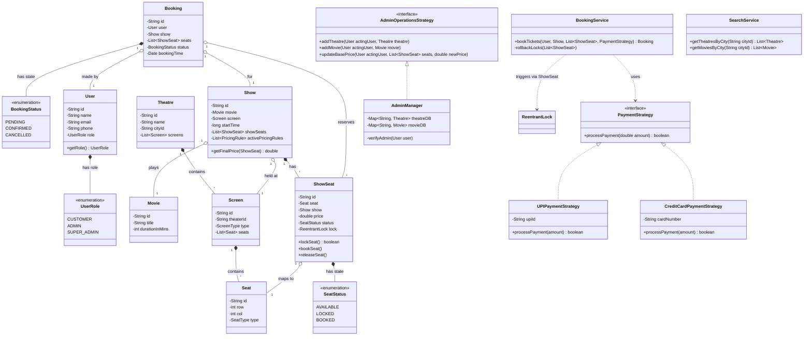

# 🎬 MovieFlow — Movie Ticket Booking System

> A production-grade, concurrent movie ticket booking backend inspired by BookMyShow — built in Java with a focus on thread safety, SOLID principles, and extensible design patterns.

---

## 🚀 What This Project Does

MovieFlow simulates the core backend of a real-world ticket booking platform. At any given second, thousands of users might try to book the last seat in a sold-out show. This system handles that gracefully — no double bookings, no race conditions, no silent failures.

---

## ✨ Key Features

### 🔒 Concurrency Control (Thread Safety)
Every `ShowSeat` holds its own `ReentrantLock`. When two users attempt to book the same seat simultaneously, exactly one succeeds — the other is safely rolled back. No seat is ever double-booked, even under heavy parallel load.

### 🛡️ Role-Based Access Control (RBAC)
Users carry a `UserRole` (`CUSTOMER`, `ADMIN`, `SUPER_ADMIN`). Every admin operation is gated behind a `verifyAdmin()` check inside `AdminManager` — unauthorized calls are rejected before they touch the database layer.

### 💳 Pluggable Payment Processing (Strategy Pattern)
Payment logic is fully decoupled from booking logic. Swapping in a new provider (PayPal, Stripe, Crypto) means implementing one interface — zero changes to `BookingService`.

### 💰 Dynamic Pricing Engine
Pricing rules (Weekend Surge, Morning Discount, etc.) are attached per-show and evaluated at booking time. Rules are composable and swappable without touching core models.

### 📦 Batch Admin Operations
Admins can update base prices across multiple `ShowSeat`s in a single authenticated call, keeping operational overhead low.

---

## 🏗️ Design Patterns

| Pattern | Where Applied | Why |
|---|---|---|
| **Strategy** | `PaymentStrategy`, `PricingRule` | Decouple algorithms from the classes that use them |
| **Interface Segregation** | `AdminOperationsStrategy` | Standard users never see admin methods |
| **Composition over Inheritance** | `User` + `UserRole` | Avoids brittle class hierarchies for role management |

---

## 📂 Package Structure

```
src/main/java/
├── enums/
│   ├── UserRole.java          # CUSTOMER, ADMIN, SUPER_ADMIN
│   ├── SeatStatus.java        # AVAILABLE, LOCKED, BOOKED
│   ├── BookingStatus.java     # PENDING, CONFIRMED, CANCELLED
│   ├── SeatType.java
│   └── ScreenType.java
│
├── models/
│   ├── User.java
│   ├── Movie.java
│   ├── Theatre.java
│   ├── Screen.java
│   ├── Seat.java
│   ├── Show.java              # Owns pricing rules + show seats
│   ├── ShowSeat.java          # Holds ReentrantLock per seat
│   └── Booking.java
│
├── strategies/
│   ├── AdminOperationsStrategy.java    # Admin interface contract
│   ├── PaymentStrategy.java            # Payment interface contract
│   ├── PricingRule.java                # Pricing interface contract
│   ├── AdminStrategiesImpl/
│   │   └── AdminManager.java           # Verified admin operations
│   └── PaymentStrategiesImpl/
│       ├── UPIPaymentStrategy.java
│       └── CreditCardPaymentStrategy.java
│
├── services/
│   ├── BookingService.java    # Core booking flow + lock management
│   └── SearchService.java    # City-level movie/theatre discovery
│
└── Main.java                  # Entry point + demo scenario
```

---

## 📊 Architecture Overview



---

## ⚙️ Core Flow: Booking a Ticket

```
User selects seats
      │
      ▼
BookingService acquires ReentrantLock on each ShowSeat
      │
      ├─ Lock fails? → rollback all acquired locks → throw exception
      │
      ▼
Payment processed via injected PaymentStrategy
      │
      ├─ Payment fails? → rollback all locks → throw exception
      │
      ▼
ShowSeat status updated: LOCKED → BOOKED
Booking record created with status: CONFIRMED
```

---

## 🔧 Extending the System

**Add a new payment method:**
```java
public class CryptoPaymentStrategy implements PaymentStrategy {
    @Override
    public boolean processPayment(double amount) {
        // your logic here
        return true;
    }
}
// Inject at booking time — no other files change.
```

**Add a new pricing rule:**
```java
public class HolidaySurgeRule implements PricingRule {
    @Override
    public double apply(double basePrice) {
        return basePrice * 1.30; // 30% holiday surge
    }
}
// Attach to a Show instance — no other files change.
```

---

## 🧱 SOLID Principles at a Glance

| Principle | How It's Applied |
|---|---|
| **S**ingle Responsibility | `BookingService` books, `SearchService` searches, `AdminManager` manages — no overlap |
| **O**pen/Closed | Add payment methods or pricing rules by extension, not modification |
| **L**iskov Substitution | Any `PaymentStrategy` impl can replace another transparently |
| **I**nterface Segregation | `AdminOperationsStrategy` keeps admin methods invisible to standard users |
| **D**ependency Inversion | `BookingService` depends on `PaymentStrategy` interface, not concrete classes |

---

## 📌 Tech Stack

- **Language:** Java
- **Concurrency:** `java.util.concurrent.locks.ReentrantLock`
- **Architecture:** Layered (models → strategies → services)
- **Patterns:** Strategy, Interface Segregation, Composition
- **Build:** Standard Maven/Gradle project structure